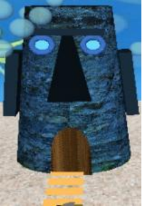
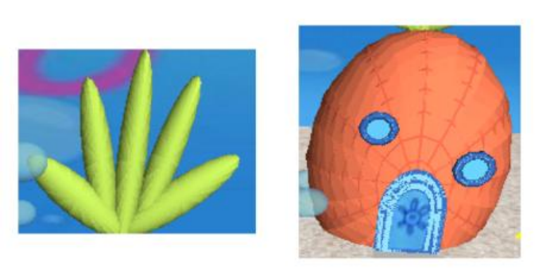
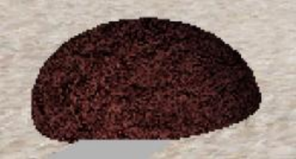
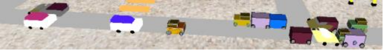
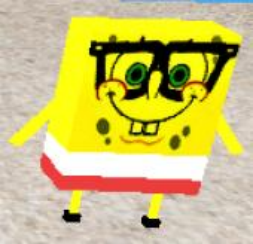
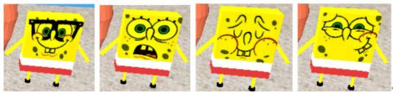
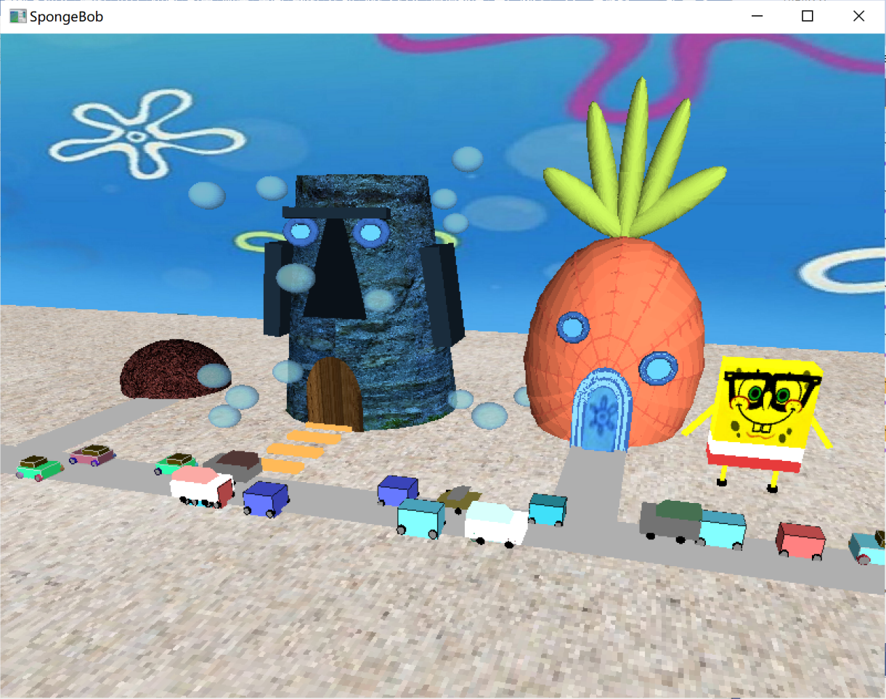
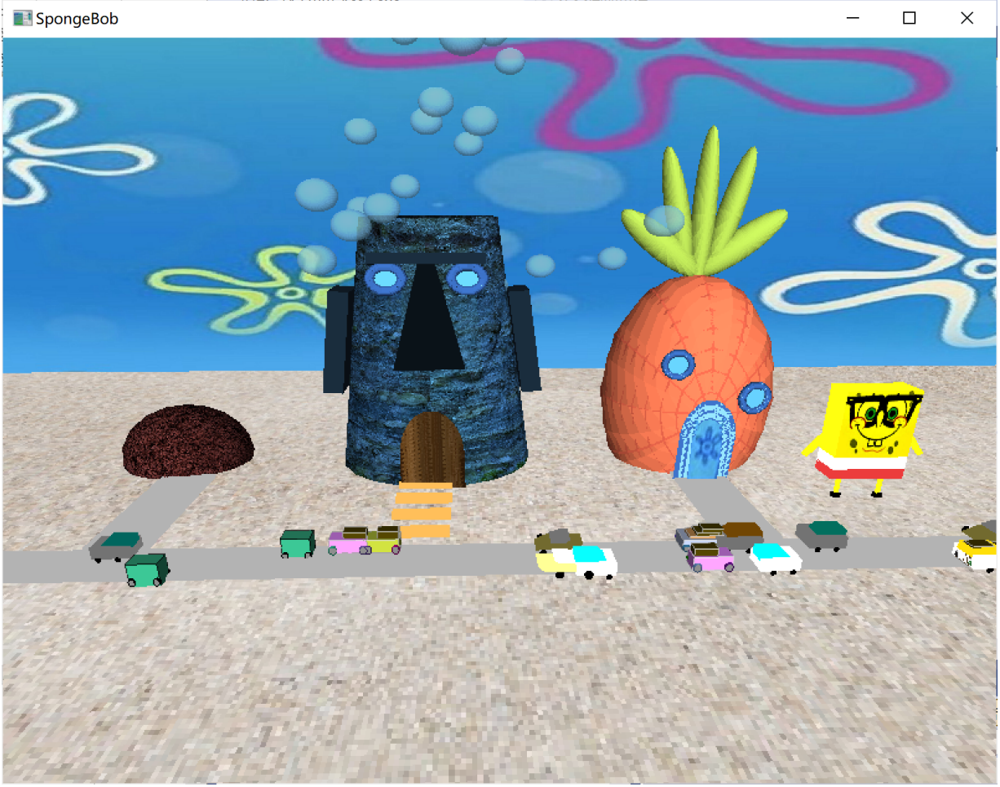

#  3D Modelling –SpongeBob

### 1  Introduction

The 3-dimensional scene simulates the Bikini Beach. The scene is mainly made of three kinds of buildings, colorful cars and a multi-expression SpongeBob. Three buildings are the Squid- ward’s head house, the pineapple house and the rock house respectively. Abundant opengl tech- niques are used to draw the scene, such as 3D modelling, light and materials, texture mapping and so on. There are also some keyboard inputs and mouse inputs to increase the interactiv-ity and fun of the application. The scene can be seen from different views and some typical screenshots are also contained below to show the program in action.

### 2  Graphic Features

##### 2.1 Buildings

There are three types of buildings showed below.

Squidward’s house: The Squidward’s head house is made by a scaled quadric and its nose and ears are made by scaled cubes. Besides, its eyes are made by a combination of a torus and a cylinder as well as its door is made by a curve. The body and the door of the head house are textured. There are also stairs that extend to the road.

 

Figure 1: Squidward’s head house

Pineapple House: The pineapple house where SpongeBob lives is in the right side of the scene. The house itself is made by a scaled sphere and is made up of two windows, a door and some leaves. The windows are made the same way as eyes of Squidward’s head house and the door is also made the same way as the door of Squidward’s head house.

Figure 2: Pineapple House

Rock House: The rock house where Patrick Star lives is also made by a scaled sphere and is textured.

 

Figure 3: Rock House

##### 2.2 Cars

There are four different types of cars made by cubes and four tires are placed to the right place through translation. What’s more, the color of cars is generated randomly and even some tires of cars can glitter, which is colorful and interesting. The speed of the car can also be adjusted by keyboard input.

Figure 4: Cars

##### 2.3 SpongeBob

There is also a SpongeBob in the right of the scene and it is made by combinations of cuboids. The SpongeBob has four different expressions and once the mouse is clicked down, the expres- sion of the SpongeBob will be changed.

 

Figure 5: SpongeBob

##### 2.4 Other environment settings

There are also some bubbles rising from below, which are made by transparent spheres. There is also an ambient light set to make the scene become brighter and show a stronger three- dimensional effect.

### 3  Interactive Section

##### 3.1 Mouse control

When clicking on the mouse, the expression of the SpongeBob will change and there’re four different expressions of SpongeBob in total.

Figure 6: Face expressions of SpongeBob

##### 3.2 Keyboard control

Some keyboard controls are set to control the action ofthe scene. For example, speeding the cars and move the eye position to change the view mode. Below shows the detail of the keyboard control.

1. ”a”: speed up cars.

2. ”b”: speed down cars.

3. ”l”: move the eye position to left.

4. ”r”: move the eye position to right.

5. ”d”: move the eye position up.

6. ”u”: move the eye position down.

7. ”p”: move the eye position closer.

8. ”e”: move the eye position farther.

9. ”i”: zoom in the scene.

10. ”o”: zoom out the scene.

11. ”m”: move the scene up.

12. ”n”: move the scene down.

13. ”,”: move the scene to left.

14. ”.”: move the scene to right.

### 4  Screenshots display

The following screenshots show the overall scene. The bubbles are kept rising and different kinds of cars in different colors are running in opposite directions.

The point of view can also be changed through keyboard input. Another view of the scene is showed below in figure 8.

 Figure 7: One view for the program 

 Figure 8: Another view for the program 